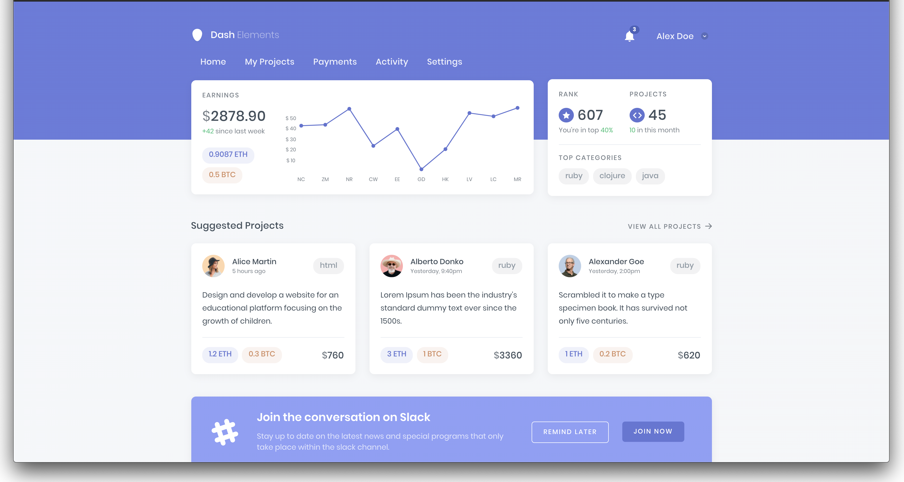
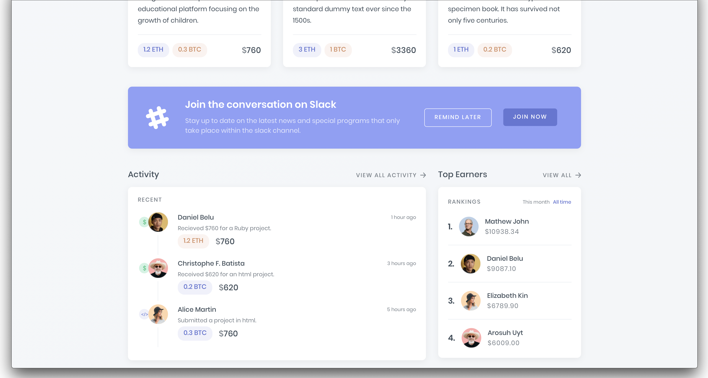
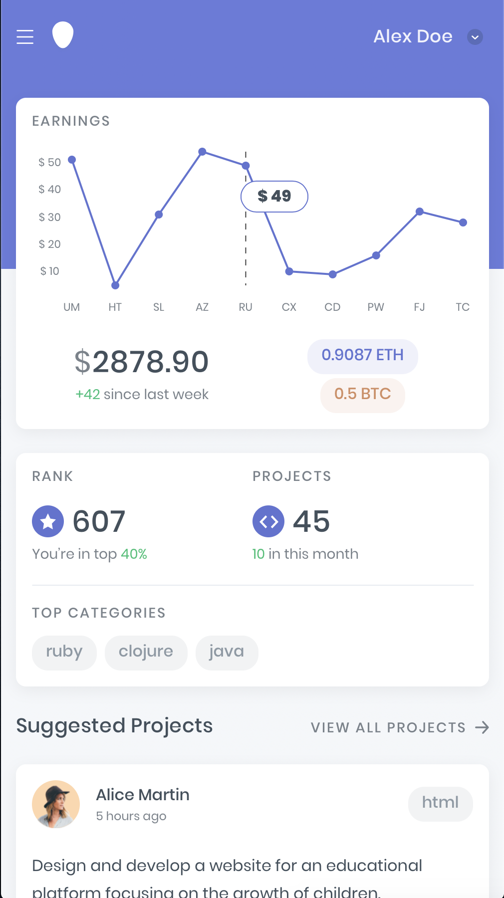
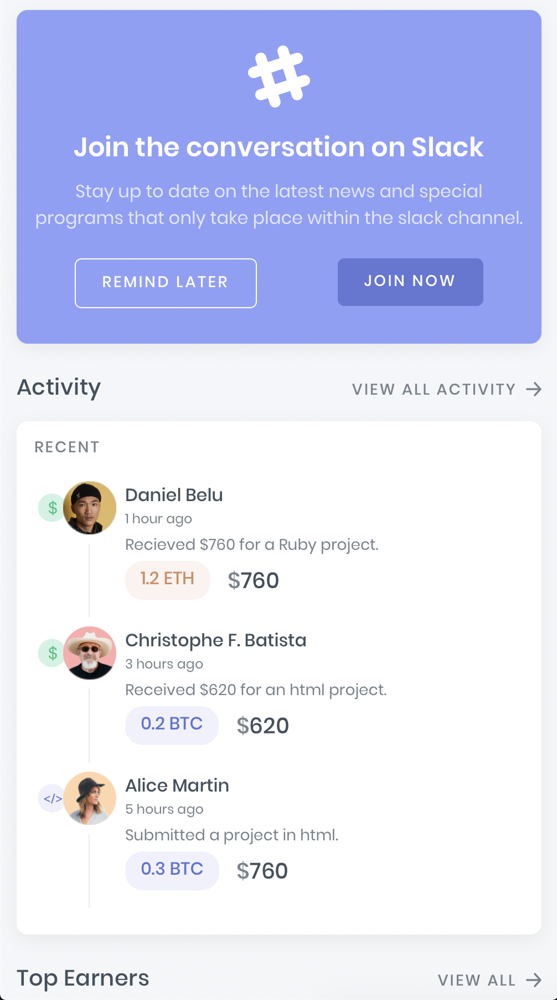
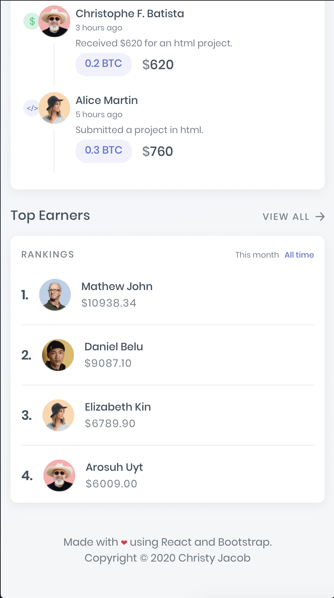

<h1 align="center">Dash Elements 🤖</h1>
<p align = center>
    
</p>

<p align="center">


  

  

  <a href="https://github.com/christyjacob4/dash-elements/blob/master/LICENSE">
    
  </a>

  <a href="https://twitter.com/christyjacob4">
    
  </a>
</p>
<h3 align="center">A responsive static site template made with React and Bootstrap. </h3>


## 🚀 Usage

This project was bootstrapped with [Create React App](https://github.com/facebook/create-react-app).

* ### Clone the repository
```sh
git clone https://github.com/christyjacob4/dash-elements
cd dash-elements
```

* ### Install dependencies
```sh
yarn
```

* ### Start developement Server
```sh
yarn start
```
Open http://localhost:3000 to view it in the browser.

### `yarn build`

Builds the app for production to the `build` folder.<br />
It correctly bundles React in production mode and optimizes the build for the best performance.

The build is minified and the filenames include the hashes.<br />
Your app is ready to be deployed!

See the section about [deployment](https://facebook.github.io/create-react-app/docs/deployment) for more information.


## ✨ Screenshots

<p align="center">
    
    
    
    
    
</p>

## 📖 Features

- [x] Responsive Design
- [x] React Components
- [x] Line Chart 


## 🍻 Contributing

Contributions, issues and feature requests are welcome.<br />
Feel free to check [issues page](https://github.com/christyjacob4/dash-elements/issues) if you want to contribute.


## 👤 Author

**Christy Jacob**

- Twitter: [@christyjacob4](https://twitter.com/christyjacob4)
- Github: [@christyjacob4](https://github.com/christyjacob4)

## 🤝 Acknowledgements
- Icons by [Flaticon](https://www.flaticon.com/)
- Thanks to [Vishnu Prasad](https://www.uplabs.com/vlockn) for the amazing UI design

## 🙌 Show your support

Please ⭐️ this repository if this project helped you!

## 📝 License

Copyright © 2019 [Christy Jacob](https://github.com/christyjacob4).<br />
This project is [MIT](https://github.com/christyjacob4/dash-elements/blob/master/LICENSE) licensed.